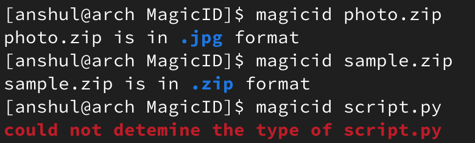

# MagicID
# What?
MagicID is the simple python script created by me to identify the type of the file using the magic numbers. This is only for the Linux systems and not for the windows.

**Magic Numbers**
Magic Numbers are a sequence of bytes at the beginning of a file that uniquely identifies the file’s format. These sequences serve as signatures, helping software applications quickly recognize and categorize files based on their content. Essentially, it’s like a secret code that reveals the nature of a file.

# Why?
Identifying the file by its extension can be unreliable. User can change extension, or programs might steel them, leading to misidentification. Magic numbers offer more accurate way to determine the file's actual format. 

Using the `magicid` you can identify the type of file by its magic numbers. There already exist a command in Unix to perform just this which is `file`. But I created this mini project just get better scripting knowledge of the python in Linux. 

# How?
The code is available in the `script.py` file. In the code first I have imported `sys`, `binascii` and `print` from `rich`. `sys` is used to get the argument passed with the script. `binascii` is used to convert the file into the hexadecimal string and `rich` is used to beautify the output.

After that I have created a dictionary of extension and their hex code, some file types have multiple hex codes so i have used list inside the dictionary to store them. This dictionary contains **100+** file extensions and their hex codes.

Then I take the argument at position 1 which is the target file and then convert it to the hexadecimal string. Then the only part remaining is to check the starting hex code of the file with each and every extension in the dictionary, If found it will tell the actual structure of the file. 

# Demo


# Extra
If you want to use the script as command in Unix system then you have to do some extra work
1. First of all clone this repo into any directory you want.
```
git-clone https://github.com/AnshulJethva10/MagicID.git
```
2. Then give the `magicid` file the executable permission.
```
chmod +x magicid
```
3. Move this `magicid` file to the `/usr/local/bin` directory.
```
sudo mv magicid /usr/local/bin 
```
4. Now restart the terminal and you can use the command.
```
magicid
```

# Future
Currently this script only works for the **Linux** but I would like to make the same script for **Windows** and **MacOS**

